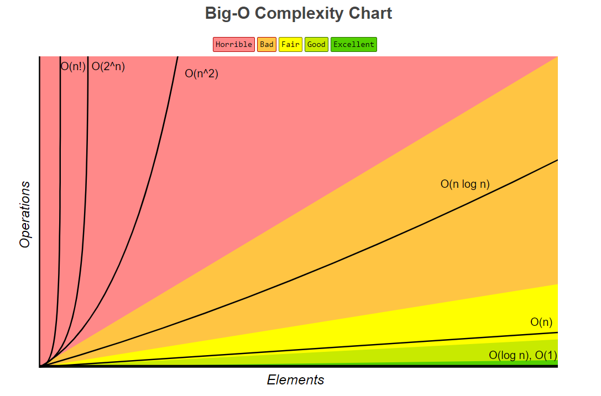
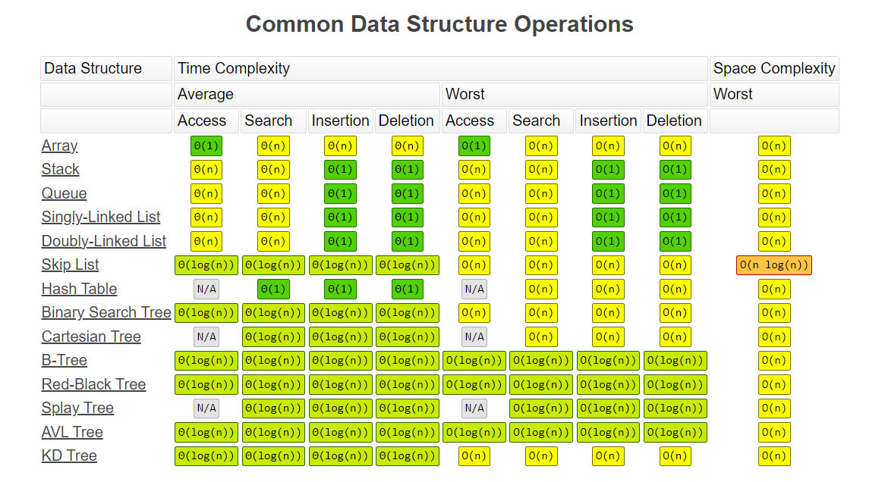
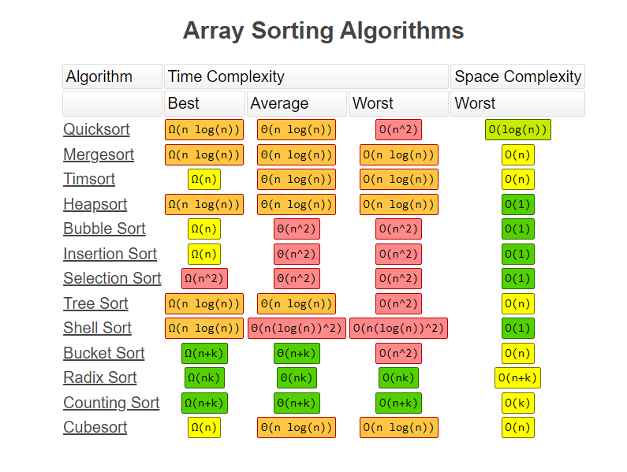
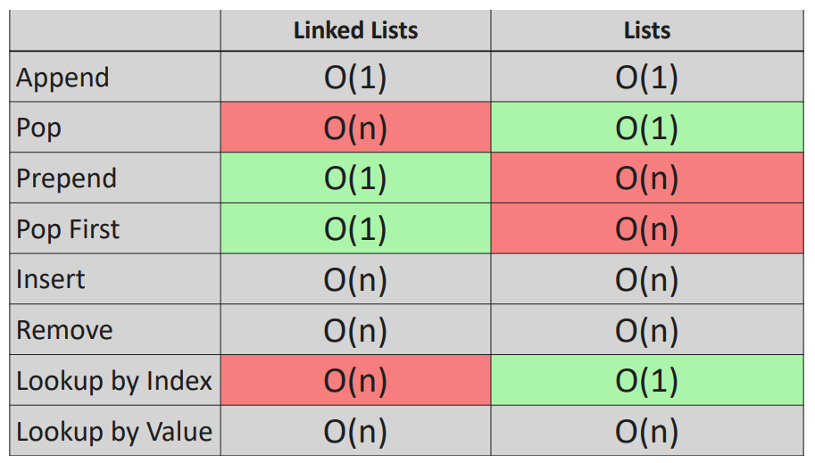

# DSA-using-python
 **

Data Structures and Algorithms
**

DSA: The term DSA stands for Data Structures and Algorithms, in the context of Computer Science.

Data Structures: 
A data structure is defined as a particular way of storing and organizing data in our devices to use the data efficiently and effectively.The main idea behind using data structures is to minimize the time and space complexities. An efficient data structure takes minimum memory space and requires minimum time to execute the data.

Algorithms: 
Algorithm is defined as a process or set of well-defined instructions that are typically used to solve a particular group of problems or perform a specific type of calculation. To explain it in simpler terms, it is a set of operations performed in a step-by-step manner to execute a task.

How to start learning DSA? 
The first and foremost thing is dividing the total procedure into little pieces which need to be done sequentially.
The complete process to learn DSA from scratch can be broken into 4 parts: 
1.  Learn about Time and Space complexities 
2.  Learn the basics of individual Data Structures 
3.  Learn the basics of Algorithms 
4.  Practice Problems on DSA 

Classification of Data Structure: 

Linear data structure: 
Data structure in which data elements are arranged sequentially or linearly, where each element is attached to its previous and next adjacent elements, is called a linear data structure. 
Linear data Structures in Python 
1. List
2. Tuple
3. Set
4. Frozenset
5. Dictonary
6. stack
7. Queue
8. array
9. linked list

Non-linear data structure:  
Data structures where data elements are not placed sequentially or linearly are called non-linear data structures. In a non-linear data structure, we can’t traverse all the elements in a single run only. 
1. Tree
2. Graph

# BigO:
 complexity of an algorithm in terms of time and space. It provides an upper bound on the growth rate of the time or space requirements of an algorithm with respect to the input size. 
 The notation is written as O(f(n)), where "f(n)" is a mathematical function that represents the upper bound of the growth rate. The most common orders of growth seen in Big O notation include: 

O(1): Constant time complexity. The algorithm's performance does not depend on the size of the input. 
O(log n): Logarithmic time complexity. Common in algorithms that divide the input in half at each step. 
O(n): Linear time complexity. The running time grows linearly with the size of the input. 
O(n log n): Linearithmic time complexity. Often seen in efficient sorting algorithms like Merge Sort and Heap Sort. 
O(n^2), O(n^3), ...: Polynomial time complexity. The running time grows with the square, cube, etc., of the size of the input. 
O(2^n), O(n!): Exponential and factorial time complexity, respectively. Algorithms with these complexities are generally considered inefficient for large inputs. 

O(n^2) : loop within a loop 
O(n) : Proportional  
O(logn) : devide and conquer 
O(1) : constant 

Big-O Complexity Chart: 

Common Data Structure Operations: 

Array Sorting Algorithms: 

# Object Oriented Programming (OOPs)
1. class : Blue print followed by Objects. Logical structure with behavior 
2. objects : Instance of a class or physical entity of a class. with the help of objects only we can access the methods and attributes of a class
3. Abstraction : Hiding Implementation details. showing essential details.
4. Encapsulation : binding/wrapping of data and function into an single entity.  
public - accessed by any class or any funtion.  protected - accessed by only class where it is declared or inherted class.  Private - data and functions accesed by only class where it is declaered.
5. Inheritance : derived class inherits the properties of base class  derived - child class.   base class - parent class 
6. Polymorphism : implementing same method in different context. implement same method in both parent and child class

# LinkedList

BigO Linkedlist VS List: 
